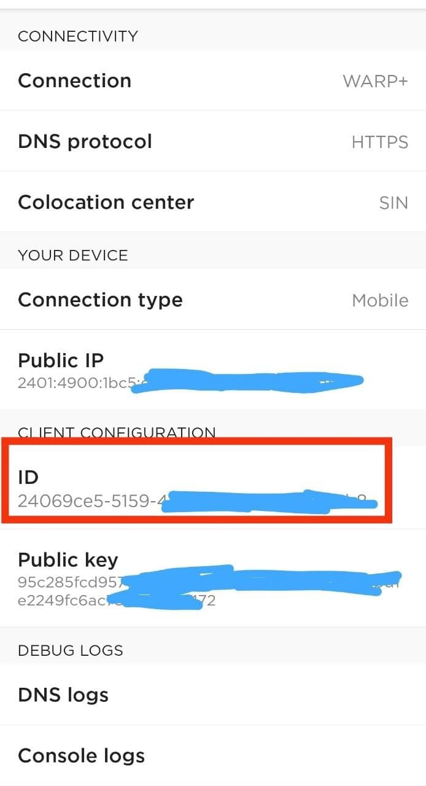
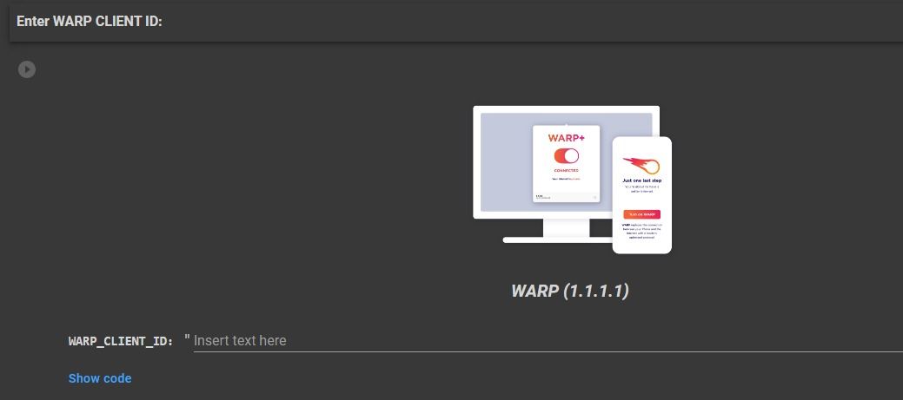
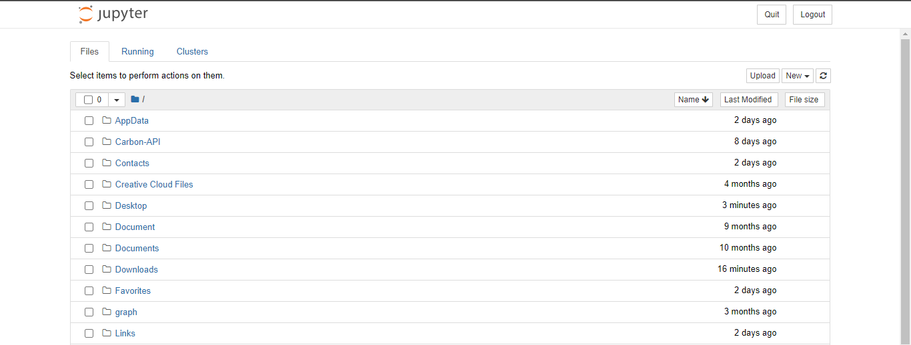
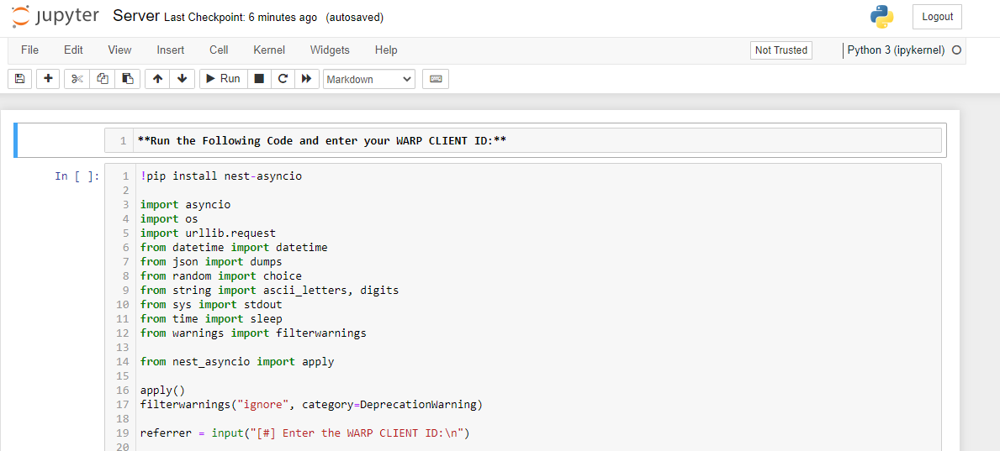

<div align="center">
<a name="warp-unlimited"></a>

# Cloudfare WARP+ UNLIMITED

**Get unlimited amount of data in Cloudflare's WARP+,code written in Python! ethically of course.**

</div>

## **INDEX**

#### **Easily navigate through out the guide and pick the best method that suits you and your requirements!**

- [**Cloudfare WARP+ UNLIMITED**](#warp-unlimited)
- [**Features**](#features)
- [**Before you proceed**](#before-you-proceed)
- [**How to use ?  How to get WARP CLIENT ID ?**](#how-to-use)
- [**→ Run on Google Colab**](#run-on-google-colab)
- [**→ 🖥️ Run on Computer**](#run-on-computer)
- [**→ 🧰 Run on Jupyter Server**](#run-on-jupyter-server)
- [**→ 📈 Update Values (📲 For Mobile & 🖥️ For Windows/Linux)**](#update-values)
- [**Download Cloudflare WARP (1.1.1.1)**](#download-cloudflare-warp-1111)
- [**FAQ**](#faq)
- [**How to use this data on PC ?**](#how-to-use-this-data-on-pc)

<a name="features"></a>

## **Features**

#### **1.Get 1GB per 30-50 seconds !**

#### **2.Run this almost everywhere !**

<a name="before-you-proceed"></a>

## **Before you proceed**

**1.It doesn't matter if you have WARP or WARP+, this program works for both.** <br>
**2.This is not hacking or gaining access to any Cloudflare system or their servers nor it is changing any official records illegally. This is just using official Cloudflare's API.**<br>
**3.Avoid hosting this program on platforms involving shared IPs to prevent response code 429 [Too many requests]. Prefer running this on your personal devices.**<br>
**4.Recommended Python Version: `3.7.x`...`3.11.x`.**

<a name="how-to-use"></a>

## **How to use ?**

#### **First get your WARP Client ID by navigating to _App > Settings > Advanced > Diagnostics_ and copy the ID under _CLIENT CONFIGURATION_ section _(note that you can get that ID only in the mobile app, not in the desktop app)_**



<a name="variables"></a>

<a name="run-on-google-colab"></a>

## **Run on Google Colab**

#### **1.Open code on Google Colab: [Open NoteBook](https://colab.research.google.com/github/TheCaduceus/WARP-UNLIMITED-ADVANCED/blob/main/ipynb/Colab.ipynb)**

#### **2.Now enter your WARP Client ID and run The WARP (1.1.1.1) code as shown in the image _(click on the Play button on top-left corner)_**



<a name="run-on-computer"></a>

## **Run on Computer**

#### **1.If your PC not have python & git installed, then install them first:**

**For Windows: (WinGet)**

```
winget install python3.10
winget install Git.Git
```

**For Linux: (APT)**

```
sudo apt-get update && sudo apt-get install -y python3.10 git pip
```

**For Mac: (HomeBrew)**

```
brew install python@3.10 git
```

#### **2.Download Repository:**

```
git clone https://github.com/djatwani/CloudfareWarpPlus.git
```

#### **3.Install requirements:**

```
pip install -r requirements.txt
```

#### **5.Run the program:**

```
py script.py
```

<a name="run-on-jupyter-server"></a>

## **Run on Jupyter Server**

##### **Setting up the Jupyter Server:**

#### **1.First install Python with PIP: [from here](https://www.python.org/downloads/)**

#### **2.Now run the CMD / Powershell as Administrator and execute following commands one-by-one:**

1.To install Jupyter:

```

pip install jupyter

```

2.To install Notebook:

```

pip install notebook

```

3.Start Jupyter Server:

```

jupyter notebook

```

#### **3.Your browser will now open, with jupyter interface.**



#### **4.Now Download the "jupyter.ipynb" file: [from here only](https://github.com/TheCaduceus/WARP-UNLIMITED-ADVANCED/blob/main/ipynb/Server.ipynb)**

#### **5.After downloading it, locate that file through your Jupyter server and open it as shown in the image and click Run.**



#### **6.Now enter your WARP Client ID and press Enter to continue.**

<a name="update-values"></a>

## **Update Values**

#### **After deploying or running this program, you have to update the "Data Remaining" value in your App.**

### **For Mobile:**

#### **Go to _Settings → Advanced → Connection Options → Press Reset Security Keys_**

### **For Windows:**

#### **Just again enter your activation key!**

### **For Linux:**

#### **Get activation key in the mobile app, then open terminal and execute:**

```

warp-cli set-license $KEY_HERE

```

<a name="download-cloudflare-warp-1111"></a>

## ** Download Cloudflare WARP (1.1.1.1)**

**Cloudflare's WARP which is based on 1.1.1.1, world's fastest DNS resolver helps you to encrypt your Network traffic and surf the web faster and available for major Operating-Systems (OS):**
**Android: [Download](https://play.google.com/store/apps/details?id=com.cloudflare.onedotonedotonedotone)**
**iOS: [Download](https://itunes.apple.com/us/app/1-1-1-1-faster-internet/id1423538627)**
**Windows: [Download](https://1111-releases.cloudflareclient.com/windows/Cloudflare_WARP_Release-x64.msi)**
**Mac: [Download](https://1111-releases.cloudflareclient.com/mac/Cloudflare_WARP.zip)**
**Linux: [Download](https://pkg.cloudflareclient.com/)**

<a name="faq"></a>

## **FAQ**

#### **1.How many instances of the program I can run simultaneously for same account?**

I will recommend to host/run 3 or less than 3 (< 3) instances for each account because Cloudflare's API have request limits. Hosting/Running too many instances can cause "429" error which indicates that API is getting too many requestes from the same account or IP and that's why there is a cooldown timer of 30-50 seconds to prevent this.

#### **2.How to resolve "429" error?**

First make sure you are running 3 or less than 3 (<3) instances of this program for same account and if this error still persist then possible reason can be that you or platform where you hosted this program is making use of shared IPs, prefer using dedicated IPs. Try running this in your personal devices.

#### **3.Will this program cause any kind of ban from Cloudflare?**

No, this program NOT cause ban because it just use the API provided by Cloudflare for referral system. Neither this program create any type of load or bypass any limit set by Cloudflare for their API nor it hacks anything or changes any official record illegally.

#### **5.Why use this program? we can simply use any mod of WARP app?**

WARP+ is for lifting the speed cap imposed by Cloudflare on free users which is server-side limit and it can't be bypassed by just modifying client-side code. WARP+ will also bypass proxies like Fortinet.

<a name="how-to-use-this-data-on-pc"></a>

## **How to use this data on PC?**

#### **Open the WARP app in your phone and go to _Settings > Account > Key_ and copy the license key, now enter that key in WARP app on Windows or MacOS or Linux.**

```

```
